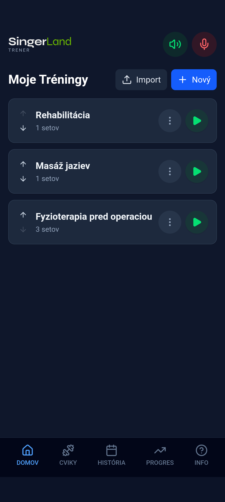
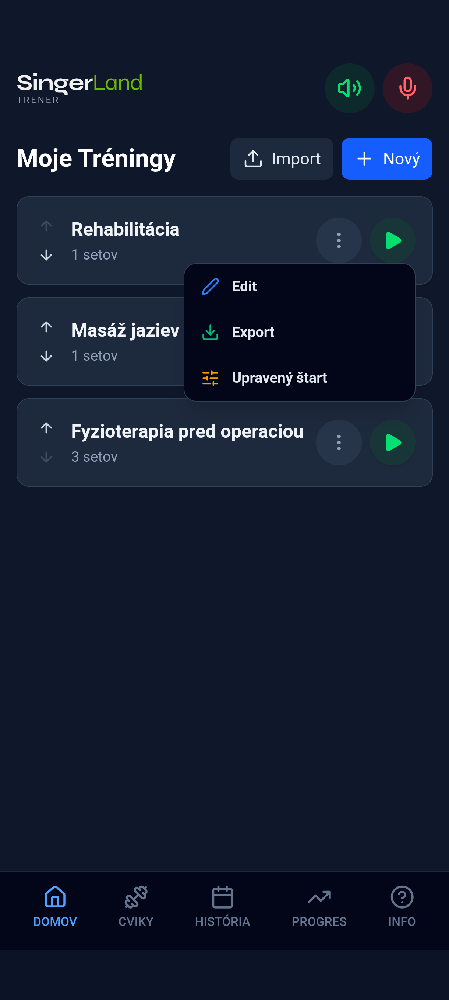
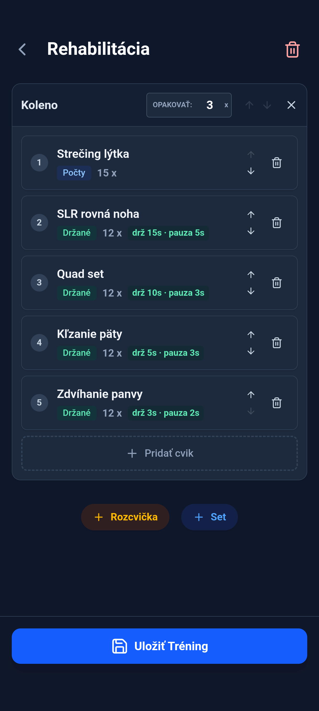
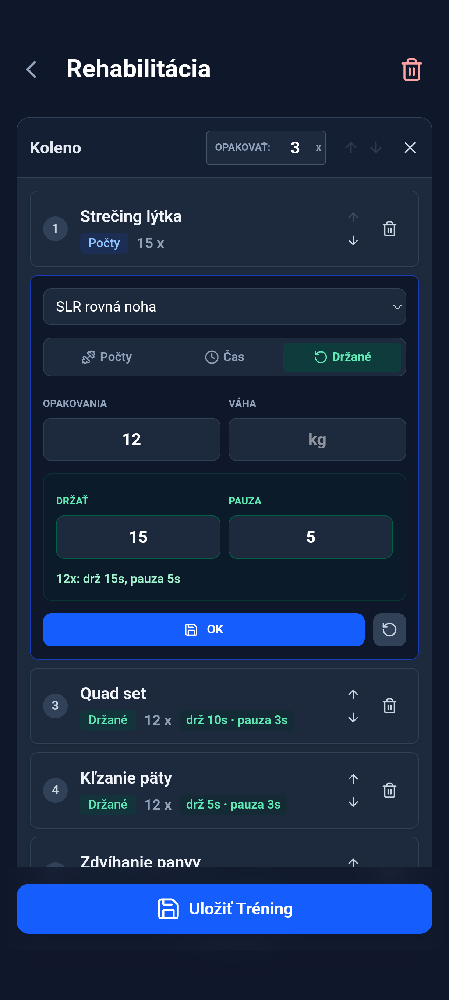
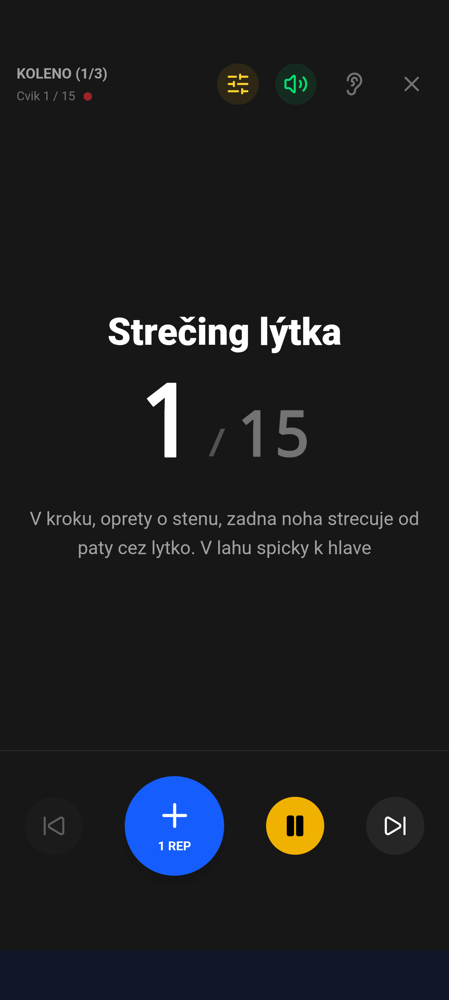
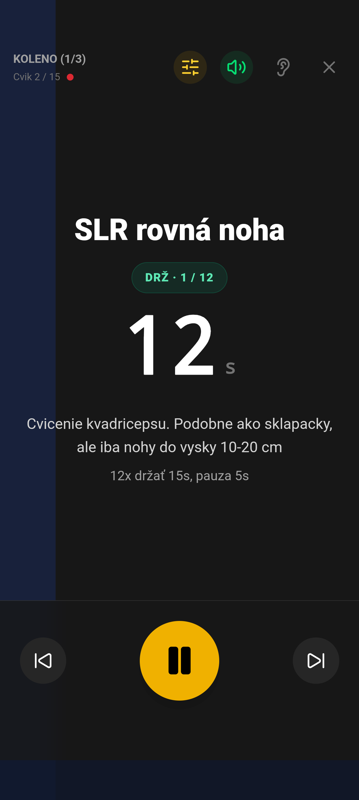
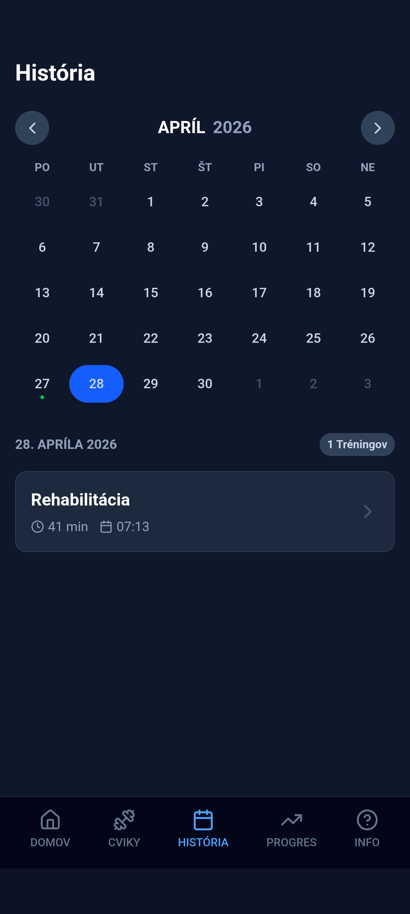
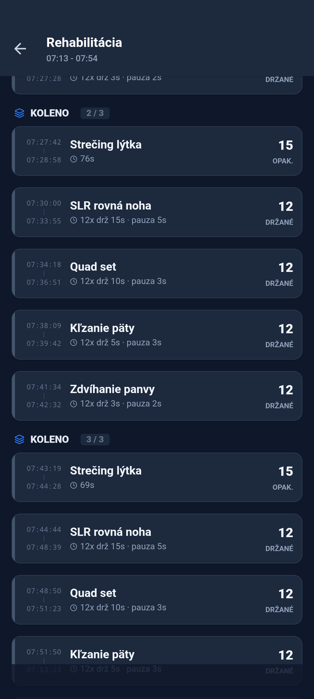
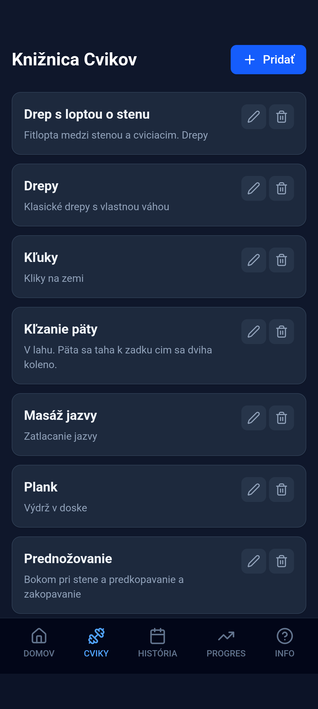
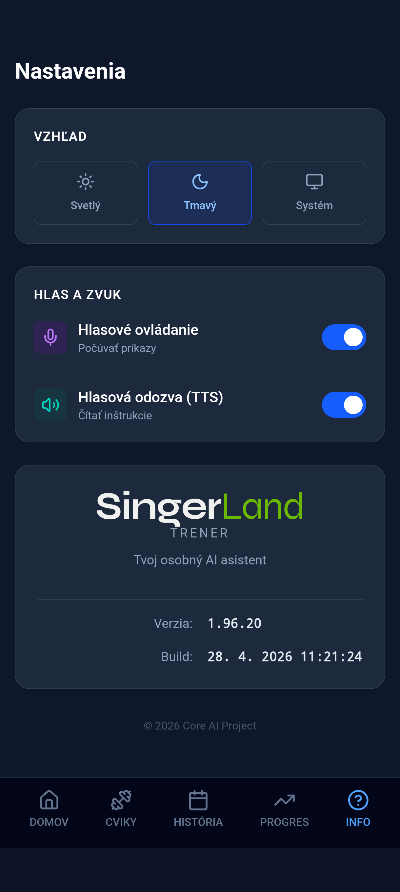

# Trener

Mobilná aplikácia na tvorbu tréningových plánov, vedený tréning, lokálnu históriu výkonov a hlasové ovládanie. Dáta sú uložené iba lokálne v zariadení.

Projekt vznikol počas rehabilitácie po operácii kolena. Potreboval som aplikáciu, ktorá ma prevedie cvikmi s čo najmenším manuálnym zásahom, pretože pri cvičení som mal často plné ruky. Aplikácia preto vie tréning oznamovať hlasom a zároveň prijímať jednoduché hlasové príkazy, aby sa dala ovládať aj bez neustáleho klikania na displej.

## Hlavná obrazovka

Na karte **Domov** je zoznam tréningov. Každý tréning má:

- šípky na zmenu poradia,
- zelené tlačidlo **Play** na okamžité spustenie,
- menu s ďalšími akciami.



V menu tréningu sú dostupné akcie:

- **Edit** - úprava uloženého tréningu,
- **Export** - zdieľanie tréningu do súboru,
- **Upravený štart** - jednorazová úprava parametrov pred spustením.



## Vytvorenie a úprava tréningu

Tréning sa skladá zo setov a cvikov. V sete nastavíš počet opakovaní setu, poradie cvikov a parametre jednotlivých cvikov.

Podporované typy cvikov:

- **Počty** - napríklad 15 opakovaní.
- **Čas** - cvik trvá nastavený počet sekúnd.
- **Držané** - opakovaný cvik s výdržou a pauzou medzi opakovaniami, napríklad `12x drž 15s, pauza 5s`.



Kliknutím na cvik otvoríš jeho detailnú úpravu. Tu sa mení typ cviku, počet, čas, váha, výdrž a pauza.

Váha je doplnkový údaj. Použi ju vtedy, keď cvik robíš s pridanou záťažou, napríklad drepy s činkou alebo inou doplnkovou váhou. Ak pri cviku váhu neriešiš, nechaj ju prázdnu alebo nulovú.



## Jednorazovo upravený štart

Ak potrebuješ tréning odcvičiť iba raz s inými hodnotami, použi v menu tréningu **Upravený štart**.

Tento režim používa rovnaký formulár ako klasická editácia, ale zmeny platia iba pre najbližšie spustenie. Pôvodný tréning sa neprepíše. Hodí sa napríklad pri kontrole u lekára alebo pri ľahšej verzii tréningu.

## Spustenie tréningu

Po spustení tréningu aplikácia postupne zobrazuje cviky. Pri počítanom cviku môžeš pridávať opakovania tlačidlom **+1 REP** alebo hlasom, ak je zapnuté hlasové ovládanie.



Pri držanom cviku aplikácia odpočítava výdrž, ukazuje aktuálne opakovanie a zobrazí aj slovný popis cviku.



Počas tréningu je hore dostupné tlačidlo rýchlej úpravy. Vieš ním zmeniť aktuálny cieľ, váhu, držanie, pauzu alebo znížiť počet kôl aktuálneho setu iba pre bežiaci tréning.

## História

Karta **História** zobrazuje kalendár a tréningy odcvičené v konkrétny deň.



Detail tréningu ukazuje časový priebeh setov a cvikov, reálne odcvičené počty, trvanie, váhy a parametre držaných cvikov.



## Knižnica cvikov

Karta **Cviky** obsahuje zoznam cvikov. Cvik má názov a voliteľný popis techniky. Tento popis sa potom zobrazuje počas live tréningu.



## Import a export tréningov

Tréning môžeš exportovať cez menu tréningu. Export vytvorí súbor so samotným tréningom aj cvikmi, ktoré tréning používa. Súbor sa dá zdieľať napríklad cez Telegram alebo e-mail.

Import je dostupný na hlavnej obrazovke tlačidlom **Import**. Pri importe aplikácia:

- nájde existujúce cviky podľa názvu,
- chýbajúce cviky vytvorí,
- ak už tréning s rovnakým názvom existuje, aktualizuje ho,
- inak vytvorí nový tréning.

## Nastavenia

Karta **Info** obsahuje nastavenia vzhľadu, hlasového ovládania, hlasovej odozvy a informácie o verzii aplikácie.



## Hlasové ovládanie

Hlasové ovládanie sa zapína v hornej časti aplikácie alebo v nastaveniach.

Aktuálne príkazy:

- `štart`, `start`, `spusti` - spustenie alebo pokračovanie cviku,
- `jeden`, `raz`, `dva`, `tri`, ... - pripočítanie opakovania pri počítanom cviku,
- `stop`, `hotovo`, `ďalej`, `dalej`, `next` - ukončenie aktuálneho cviku.

Na pozastavenie tréningu použi tlačidlo v aplikácii. Hlasový povel `pauza` nie je v dokumentácii odporúčaný, pretože pri držaných cvikoch aplikácia slovo „pauza“ používa aj ako hlasovú odozvu medzi opakovaniami.

## Lokálne dáta

Aplikácia ukladá tréningy, cviky, históriu a nastavenia lokálne v zariadení. Ak chceš tréning preniesť do iného zariadenia, použi export a import.

## Vývoj a build

Frontend je React + TypeScript + Vite. Android wrapper beží cez Capacitor.

```bash
npm install
npm run dev
npm run build
make rebuild-apk
make deploy
```

`npm run build` spustí TypeScript kontrolu a Vite build do `dist`.

Android build používa Makefile:

```bash
make sync
make rebuild-apk
make sign
make install
```

Výsledné APK sa uloží ako `Trener.apk`, podpísaná verzia ako `Trener.sign.apk`.

## Poznámka o AI

Táto aplikácia bola vygenerovaná a priebežne upravovaná pomocou AI.

## Open source

Projekt je open source. Kód môžeš používať, upravovať a ďalej šíriť podľa licencie uvedenej v repozitári.
